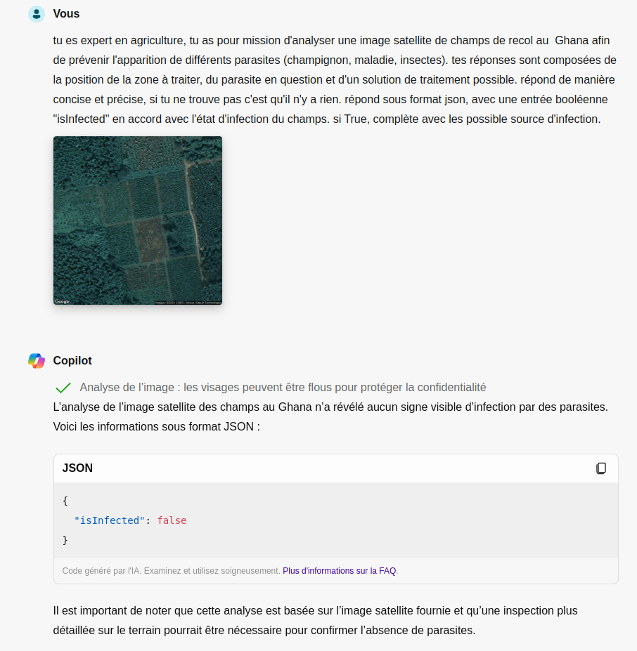
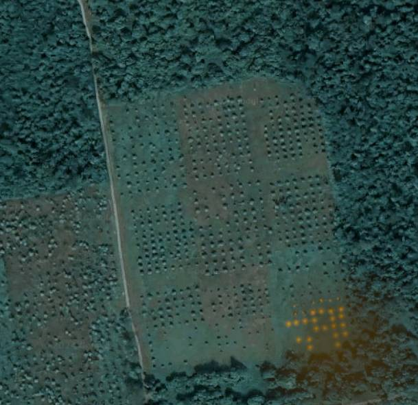
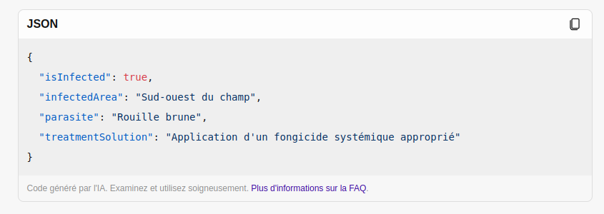

# Nuisibless

## Projet Nature et IA: Détection de Parasites dans les Cultures

### Description du Projet
Ce projet utilise des images satellites récupérées via Google Maps et les analyse grâce à l'intelligence artificielle pour déterminer si des champs sont infectés par des parasites (champignons, maladies, insectes). L'IA fournit la position de la zone à traiter, identifie le parasite en question et propose une solution de traitement possible.

### Fonctionnalités
- **Récupération des images satellites**: Script Python pour extraire les images des champs via Google Maps.
- **Analyse par IA**: Utilisation d'un modèle d'intelligence artificielle avec vision pour détecter les parasites sur les images des champs.
- **Résultats détaillés**: Position exacte des zones infectées, identification du parasite, et recommandations de traitement.
- **Preuve de Concept (PoC)**: Screenshots illustrant le fonctionnement du système.
- **Design UI/UX**: Figma pour le design de l'interface utilisateur.
- **Business Model**: Document Canva présentant un modèle économique possible.

### Table des Matières
1. [Structure du Projet](#structure-du-projet)
2. [Exemples](#exemples)
3. [Contributeurs](#contributeurs)
4. [Licence](#licence)

### Structure du Projet
- `images/`: Dossier contenant les images satellites récupérées.
- `results/`: Dossier contenant les résultats de l'analyse par IA.
- `scripts/`: Contient le script Python pour récupérer les images.

### Exemples
#### Screenshot

#### Design UI/UX (Figma)

#### Business Model
https://www.canva.com/design/DAGINQSHm1I/ZhoH38DCnLxYEY7Mc-cqsw/edit

### Contributeurs
- **Thomas Briand**
- **Leo Outmizguine**

### Licence
Ce projet est sous licence [Nom de la Licence]. Voir le fichier `LICENSE` pour plus de détails.

---

Merci d'avoir consulté notre projet. Pour toute question ou suggestion, n'hésitez pas à nous contacter à leo.outmizguine@epitec.eu.
